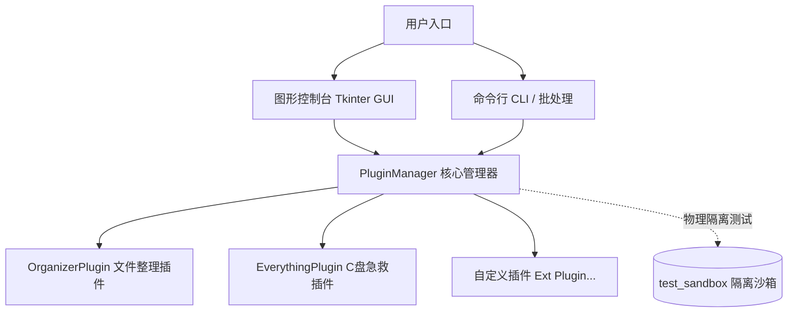

# 🔌 HandyWorkstation (本地实用工具与插件集成平台)

[](https://www.python.org/)
[](LICENSE)
[](https://docs.python.org/3/)
[](https://github.com/astral-sh/ruff)

轻量级、零外部依赖、微插件架构的 Windows 本地系统维护与实用工具集成控制台。

---

## 🌟 核心特性 (Key Features)

- 🔌 **微插件解耦架构**：通过 `BasePlugin` 契约抽象，插件间彻底解耦，支持生命周期自检、测试与图形化动态绑定。
- 🛡️ **物理隔离测试沙箱**：内置沙箱隔离引擎，每个插件均在独立物理子目录进行断言校验，不污染用户盘符与实际文件。
- ⚡ **开箱即用与零依赖降级**：核心库基于 Python 标准库 (Tkinter) 开发，未安装 Python 亦可通过打包产物直接运行。
- 📦 **自动化一键打包**：提供内置 PyInstaller 编译规格与批处理，一键构建独立免安装 `.exe` 软件。
- 🚥 **CI / CD 质量门禁**：集成全流程质量检查脚本，自动覆盖静态代码规约、敏感文件防护、沙箱集成与可执行文件校验。

---

## 🏗️ 平台架构设计 (Architecture)



---

## 📅 项目目录结构 (Directory Tree)

```text
HandyWorkstation/
├── app/                        # 平台主程序包
│   ├── core/                   # 核心服务层
│   │   ├── base_plugin.py      # 插件契约基类与生命周期定义
│   │   └── plugin_manager.py   # 插件管理器及沙箱隔离驱动
│   ├── plugins/                # 业务插件库
│   │   ├── organizer_plugin.py # 文件规格化整理与 HTML 看板插件
│   │   └── everything_plugin.py# Everything C盘空间急救插件
│   └── gui/                    # 统一控制台图形界面
│       └── main_window.py      # 双栏式 Tkinter 现代化控制面板
├── test_sandbox/               # 物理隔离测试沙箱 (运行自测时自动创建)
├── HandyWorkstation.spec       # PyInstaller 打包配置文件
├── rules.json                  # 文件规格化整理规则库
├── main.py                     # 平台统一主入口 (支持 GUI 与 CLI 模式)
├── run.bat                     # Windows 快捷启动控制台脚本
├── build.bat                   # 一键自动化打包构建脚本 (.exe)
├── check.py / check.bat        # 全流程质量门禁校验引擎与脚本
└── README.md                   # 项目架构与使用指南
```

---

## 🚀 启动与运行指南 (Usage)

### 1. 双击快捷运行 (推荐)
- **[run.bat](file:///e:/tools/selfDefinetion/HandyWorkstation/run.bat)**: 唤起快捷控制台菜单（启动 GUI、沙箱集成自测试或搭建演示测试目录）。
- **[check.bat](file:///e:/tools/selfDefinetion/HandyWorkstation/check.bat)**: 一键运行全流程质量门禁，校验代码规约、防泄露、沙箱测试及产物可用性。
- **[build.bat](file:///e:/tools/selfDefinetion/HandyWorkstation/build.bat)**: 自动检测环境并打包出独立 `.exe` 软件。

### 2. 命令行控制指令
- **启动 GUI 图形控制台**：
  ```powershell
  python main.py
  ```
- **静默测试所有插件 (工程自测/CI 回归)**：
  ```powershell
  python main.py --test-all
  ```
- **生成演示用混乱测试目录**：
  ```powershell
  python main.py --setup-test
  ```

---

## 📦 打包与软件分发 (Distribution)

本项目原生支持通过 **PyInstaller** 导出 Windows 免环境运行包：

1. 双击运行 [build.bat](file:///e:/tools/selfDefinetion/HandyWorkstation/build.bat)。
2. 打包产物输出至：`dist/HandyWorkstation/HandyWorkstation.exe`。
3. 可直接将 `dist/HandyWorkstation/` 文件夹压缩分发给普通 Windows 用户使用。

---

## 💡 新插件二次开发指南 (Plugin Developer Guide)

开发并集成一个全新插件仅需 3 步：

1. **创建插件模块**：在 `app/plugins/` 下新建 Python 文件（如 `duplicate_finder.py`）。
2. **实现接口契约**：继承 `BasePlugin` 并实现 `id`, `name`, `description`, `run_test`, `execute` 方法：
   ```python
   from typing import Tuple, Dict, Any
   from app.core.base_plugin import BasePlugin

   class DuplicateFinderPlugin(BasePlugin):
       @property
       def id(self) -> str:
           return "dup_finder"

       @property
       def name(self) -> str:
           return "🔍 重复文件定位插件"

       @property
       def description(self) -> str:
           return "快速扫描并清理重复冗余文件"

       def run_test(self, sandbox_dir: str) -> Tuple[bool, str]:
           # 在独立物理沙箱中运行逻辑断言
           return True, "沙箱测试成功"

       def execute(self, params: Dict[str, Any]) -> Tuple[bool, str]:
           # 执行插件业务逻辑
           return True, "执行完成"
   ```
3. **注册插件**：在 [main.py](file:///e:/tools/selfDefinetion/HandyWorkstation/main.py) 中注册：
   ```python
   pm.register_plugin(DuplicateFinderPlugin())
   ```
平台将**自动捕获新插件**，并自动在 GUI 控制台上渲染对应的测试状态与功能按钮！

---

## 📄 开源许可证 (License)

[MIT License](LICENSE)
